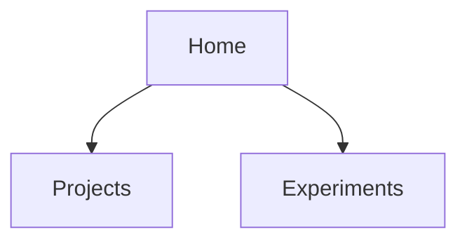
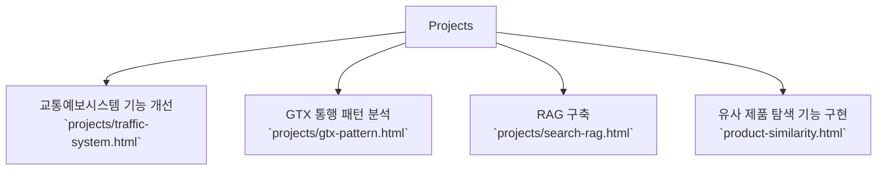
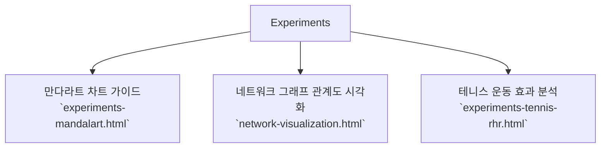

# 사이트 화면 구조 (Information Architecture)

## 1. Home

- 파일: `index.html`
- 목적: 깃허브 포트폴리오 메인 랜딩 페이지
- 주요 섹션:
    - 

- 내비게이션바 이동 경로
    - HOME 클릭 → `index.html`의 Home Banner Area로 이동
    - ABOUT 클릭 → `index.html`의 Welcome Area로 이동
    - PROJECTS 클릭 → `index.html`의 Projects Area로 이동
    - EXPERIMENTS 클릭 → `index.html`의 Experiments Area로 이동
    - BLOG 클릭 → `index.html`의 Blog Area로 이동
    - CONTACT 클릭 → `index.html`의 Home Contact Area로 이동

- Projects 이동 경로
    - 교통예보시스템 기능 개선 → `projects/traffic-system.html`
    - GTX 통행 패턴 분석 → `projects/gtx-pattern.html`
    - RAG 구축 → `projects/search-rag.html`
    - 유사 제품 탐색 기능 구현 → `product-similarity.html`
    
- Experiments 이동 경로
    - 만다라트 차트 가이드 → `experiments-mandalart.html`
    - 네트워크 그래프 관계도 시각화 → `network-visualization.html` 
    - 테니스 운동 효과 분석 → `experiments-tennis-rhr.html`

- 블로그 이동 경로
    - 슬랙 전송 자동화 → `https://wewegh.tistory.com/150` 
    - 사계절 → `https://wewegh.tistory.com/135` 
    - 딥러닝 원리 → `https://wewegh.tistory.com/78` 

## 페이지 구조

---

---

